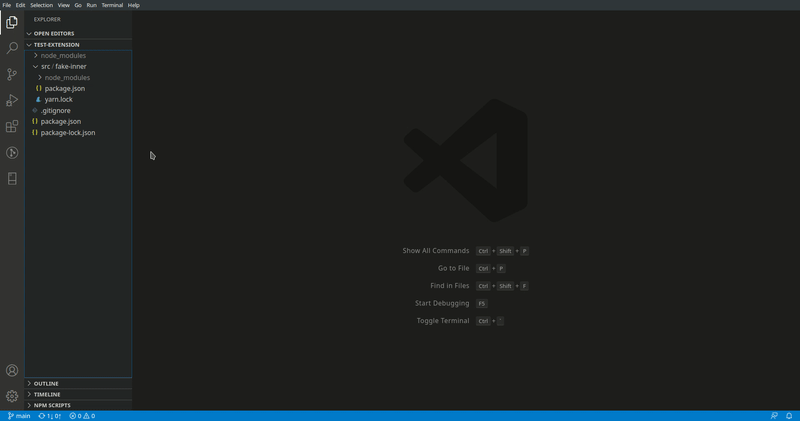

# Refresh NPM Packages

Refresh NPM Packages is the VS Code extension that prompts you to run a fresh install when you pull an updated package-lock.json or yarn.lock.

## Requirements

This extension is intended for workspaces that have source control and for which the lock file might be updated on the remotes.

This extension only works when opening a workspace folder in VS Code that contains at least one lock file for NPM Packages.

## Known Issues

At the moment there are no known issues. If you find any please contibute using the repo [issues tab](https://github.com/MatteoPieroni/refresh-npm-packages/issues)

## Release Notes

See [changelog](https://github.com/MatteoPieroni/refresh-npm-packages/blob/main/CHANGELOG.md)

-----------------------------------------------------------------------------------------------------------

**Enjoy!**
